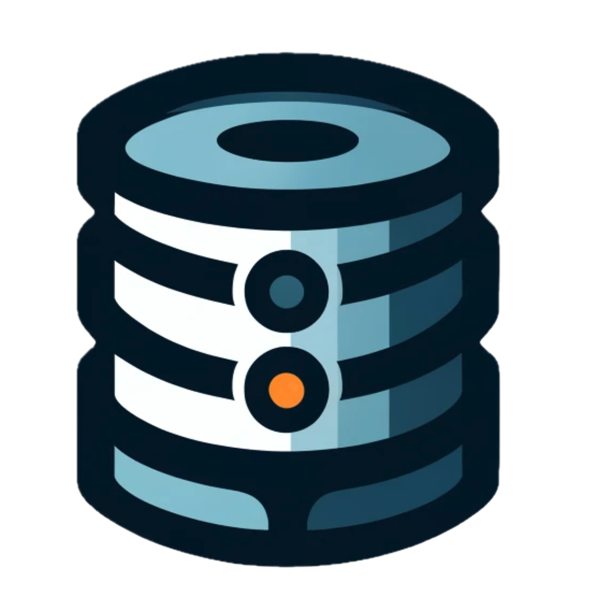

  
  SereneDB

### Features
- JSON based table creation/update schemas
- Terraform like behavior for applying changes to schemas
- Cross Table Relations with an emhpasis on easy of use and peformance
- Aggregates
    - Group By
    - SUM, MIN, MAX
- Formatting
    - String Manipulation
    - Date Manipulation
- JSON Rest API for sending queries to the database

